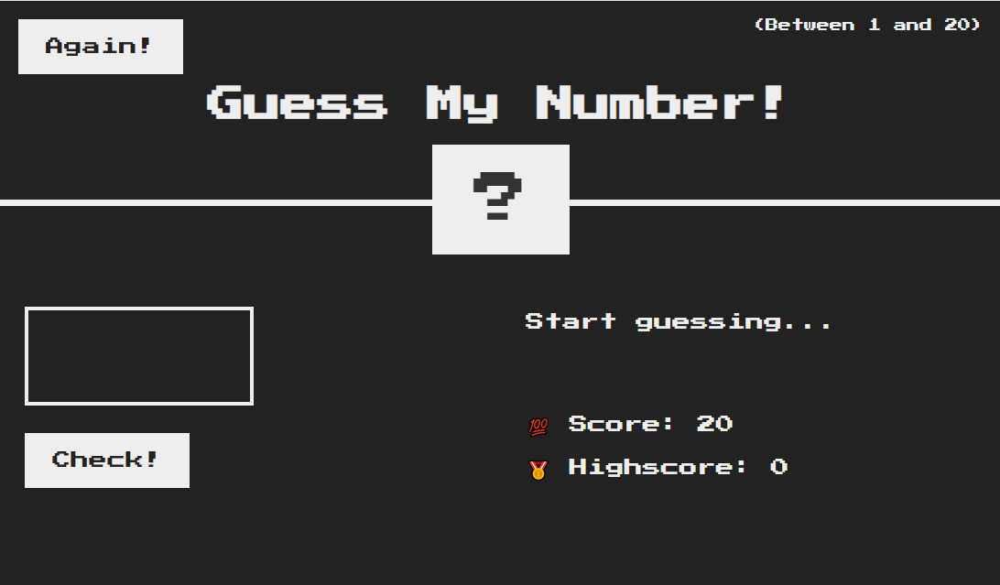

# Guess The Number Game

This is a simple "Guess The Number" game built with HTML, CSS, and JavaScript.

## Features

- Random number generation between 1 and 20
- User input validation
- Score tracking and high score feature
- Responsive design

## How to Play

1. Guess the number by entering a value between 1 and 20.
2. Click the "Check!" button to see if your guess is correct.
3. Your score decreases with each wrong guess.
4. Click "Again!" to restart the game.

## Setup

1. Clone the repository: `git clone <repository-url>`
2. Open `index.html` in your web browser to play the game.

## Screenshot

